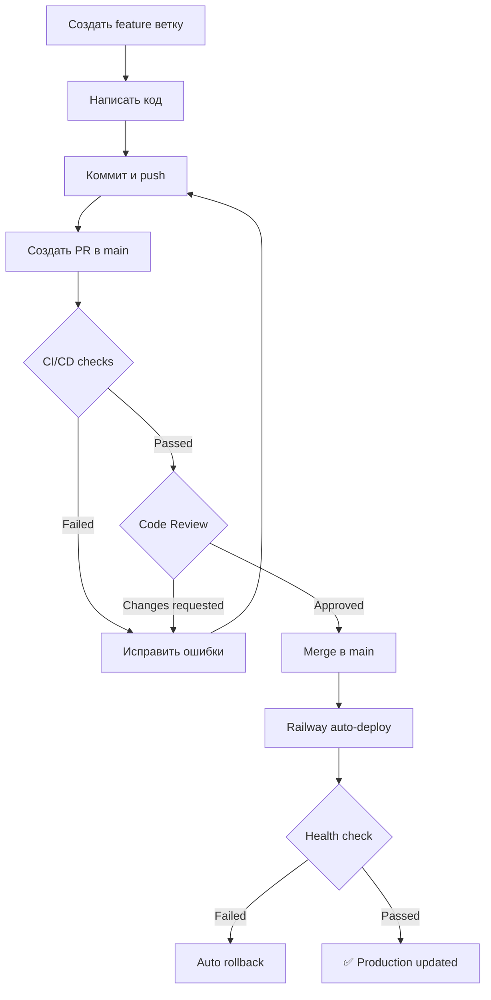

# 🛡️ Настройка GitHub Branch Protection

## 📋 Содержание

- [Зачем нужна защита веток](#зачем-нужна-защита-веток)
- [Пошаговая инструкция](#пошаговая-инструкция)
- [Рекомендуемые настройки](#рекомендуемые-настройки)
- [Проверка работы](#проверка-работы)
- [Troubleshooting](#troubleshooting)

---

## 🎯 Зачем нужна защита веток

**Branch Protection** в GitHub предотвращает случайные или преднамеренные ошибки при работе с критичными ветками (main, production).

### Преимущества:

✅ **Блокировка деплоя** при провале тестов
✅ **Обязательный code review** перед merge
✅ **Защита от force push** и удаления веток
✅ **Требование актуальности** ветки перед merge
✅ **Автоматическая проверка** через CI/CD

---

## 📝 Пошаговая инструкция

### Шаг 1: Открыть настройки репозитория

1. Перейдите в ваш GitHub репозиторий
2. Нажмите **Settings** (⚙️) в верхнем меню
3. В левом меню выберите **Branches** (под разделом "Code and automation")

### Шаг 2: Добавить правило защиты

1. Найдите раздел **Branch protection rules**
2. Нажмите **Add rule** (или **Add branch protection rule**)
3. В поле **Branch name pattern** введите: `main`

### Шаг 3: Настроить требования

Включите следующие опции:

#### 🔒 Базовая защита

- ✅ **Require a pull request before merging**
  - ✅ Require approvals: **1** (минимум)
  - ✅ Dismiss stale pull request approvals when new commits are pushed
  - ✅ Require review from Code Owners (опционально)

#### 🧪 Требования CI/CD

- ✅ **Require status checks to pass before merging**
  - ✅ Require branches to be up to date before merging

  В поиске **Status checks** найдите и добавьте:
  - `🐍 Python Tests` (обязательно!)
  - `🔍 Code Quality` (рекомендуется)
  - `🔒 Security Check` (рекомендуется)
  - `🚀 Deploy Readiness Check` (обязательно!)

#### 🛡️ Дополнительная защита

- ✅ **Require conversation resolution before merging**
  - Все комментарии в PR должны быть resolved

- ✅ **Require signed commits** (опционально, для высокой безопасности)

- ✅ **Require linear history** (рекомендуется)
  - Предотвращает merge commits, только rebase/squash

- ✅ **Include administrators**
  - Правила применяются даже к админам репозитория

#### ❌ Защита от опасных действий

- ✅ **Do not allow bypassing the above settings**

- ✅ **Restrict who can push to matching branches** (опционально)
  - Можно ограничить список людей, кто может пушить в main

- ✅ **Do not allow force pushes**

- ✅ **Do not allow deletions**

### Шаг 4: Сохранить правила

1. Прокрутите вниз
2. Нажмите **Create** или **Save changes**

---

## ✨ Рекомендуемые настройки

### Для Production (main ветка)

```yaml
Branch name pattern: main

✅ Require pull request before merging
   - Required approvals: 1
   - Dismiss stale approvals: Yes

✅ Require status checks to pass
   - Require branches to be up to date: Yes
   - Required checks:
     * 🐍 Python Tests
     * 🚀 Deploy Readiness Check

✅ Require conversation resolution: Yes
✅ Require linear history: Yes
✅ Include administrators: Yes
✅ Do not allow bypassing: Yes
✅ Do not allow force pushes: Yes
✅ Do not allow deletions: Yes
```

### Для Development (develop ветка)

```yaml
Branch name pattern: develop

✅ Require status checks to pass
   - Require branches to be up to date: Yes
   - Required checks:
     * 🐍 Python Tests

⚠️ Require pull request: No (опционально)
✅ Do not allow force pushes: Yes
✅ Do not allow deletions: Yes
```

---

## 🧪 Проверка работы

### Тест 1: Попытка прямого push в main

```bash
# Находясь в ветке main
echo "test" > test.txt
git add test.txt
git commit -m "test"
git push origin main
```

**Ожидаемый результат:**
```
❌ remote: error: GH006: Protected branch update failed
❌ error: failed to push some refs
```

✅ **Защита работает!**

### Тест 2: Создание PR с провалившимися тестами

1. Создайте новую ветку
2. Сломайте какой-нибудь тест
3. Создайте PR в main
4. Попробуйте нажать "Merge"

**Ожидаемый результат:**
```
❌ Merging is blocked
   Required status check "🐍 Python Tests" is failing
```

✅ **Блокировка работает!**

### Тест 3: Успешный merge через PR

1. Создайте новую ветку с корректными изменениями
2. Запушьте изменения
3. Создайте PR в main
4. Дождитесь прохождения всех checks (зелёные галочки ✅)
5. Получите approval от reviewer
6. Нажмите "Merge"

**Ожидаемый результат:**
```
✅ All checks have passed
✅ Review approved
✅ Branch is up to date
🎉 Merge allowed!
```

---

## 🔧 Настройка для команды

### Добавление Code Owners (опционально)

Создайте файл `.github/CODEOWNERS`:

```
# Code owners for this project
* @username1 @username2

# Specific paths
bot/ @lead-developer
.github/ @devops-engineer
tests/ @qa-engineer
```

Теперь PR автоматически назначается нужным людям для review.

### Настройка автоматического merge

Для автоматизации можно включить **auto-merge** в PR:

```bash
# В PR после создания
gh pr merge --auto --squash
```

PR автоматически сольётся после прохождения всех checks и approval.

---

## 🔄 Workflow с Branch Protection

### Нормальный процесс разработки:



### Команды Git:

```bash
# 1. Создать feature ветку
git checkout -b feature/my-feature

# 2. Работать и коммитить
git add .
git commit -m "feat: добавлена новая функция"

# 3. Запушить ветку
git push origin feature/my-feature

# 4. Создать PR через GitHub UI или CLI
gh pr create --base main --head feature/my-feature

# 5. После merge в main - Railway автоматически деплоит
```

---

## 🆘 Troubleshooting

### Проблема: "Cannot push to main"

**Причина:** Branch protection включена

**Решение:** Используйте PR вместо прямого push

```bash
git checkout -b hotfix/urgent-fix
git add .
git commit -m "fix: urgent bug"
git push origin hotfix/urgent-fix
# Создайте PR через GitHub
```

### Проблема: "Required status check is failing"

**Причина:** Тесты не проходят

**Решение:**

```bash
# Запустите тесты локально
python -m pytest tests/ -v

# Исправьте ошибки
# Закоммитьте и запушьте
git add .
git commit -m "fix: исправлены тесты"
git push
```

### Проблема: "Branch is out of date"

**Причина:** Main ветка обновилась с момента создания PR

**Решение:**

```bash
# Обновите вашу ветку
git checkout feature/my-feature
git pull origin main
git push origin feature/my-feature
```

### Проблема: "Need approval but I'm the only developer"

**Решение:**

В настройках Branch Protection:
- Уберите галочку с **Include administrators**
- Или установите **Required approvals: 0**

Или добавьте второго developer в проект.

---

## 📊 Проверка статуса защиты

### Через GitHub UI:

1. Settings → Branches
2. Увидите список правил и их статус
3. Можно редактировать или удалить правила

### Через GitHub API:

```bash
# Получить правила для main ветки
gh api repos/:owner/:repo/branches/main/protection

# Проверить статус
gh api repos/:owner/:repo/branches/main
```

---

## 📈 Best Practices

### ✅ Рекомендуется:

1. **Всегда включайте** Branch Protection для main/production
2. **Требуйте прохождения тестов** перед merge
3. **Используйте PR** даже для маленьких изменений
4. **Настройте CODEOWNERS** для автоматического review
5. **Документируйте процесс** для новых членов команды

### ⚠️ Не рекомендуется:

1. ❌ Обходить Branch Protection через admin права
2. ❌ Делать force push в protected ветки
3. ❌ Мержить PR с failing tests "на потом исправим"
4. ❌ Пропускать code review
5. ❌ Удалять защиту "на минутку для срочного фикса"

---

## 🎓 Дополнительные ресурсы

- [GitHub Branch Protection Docs](https://docs.github.com/en/repositories/configuring-branches-and-merges-in-your-repository/managing-protected-branches)
- [GitHub Required Status Checks](https://docs.github.com/en/pull-requests/collaborating-with-pull-requests/collaborating-on-repositories-with-code-quality-features/about-status-checks)
- [GitHub CODEOWNERS](https://docs.github.com/en/repositories/managing-your-repositorys-settings-and-features/customizing-your-repository/about-code-owners)

---

## ✅ Checklist настройки

После настройки проверьте:

- [ ] Branch Protection правило создано для `main`
- [ ] Требуется PR перед merge
- [ ] Требуется минимум 1 approval
- [ ] Требуется прохождение status checks
- [ ] Status check `🐍 Python Tests` обязателен
- [ ] Status check `🚀 Deploy Readiness Check` обязателен
- [ ] Force push запрещён
- [ ] Удаление ветки запрещено
- [ ] Правила применяются к администраторам
- [ ] Протестировали попытку прямого push (должна блокироваться)
- [ ] Протестировали merge через PR (должен работать)

---

**✅ Готово! Ваша main ветка теперь защищена!**

*Создано для проекта RPRZ Safety Bot | Октябрь 2025*

